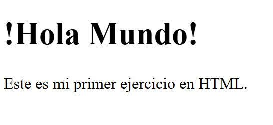
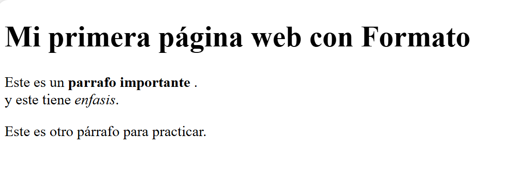
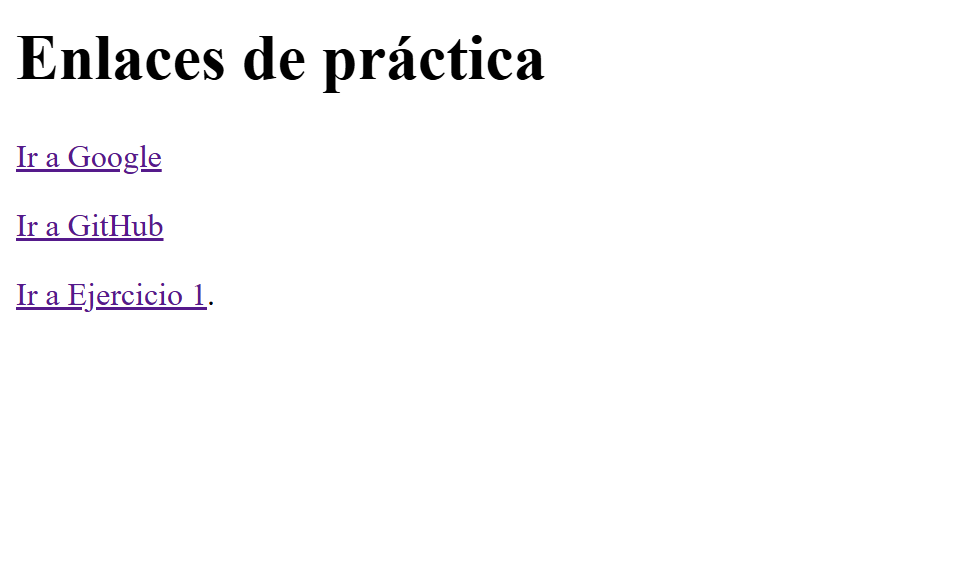
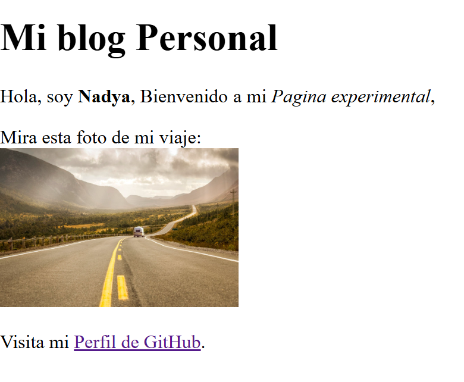
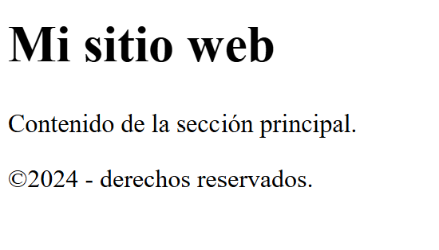
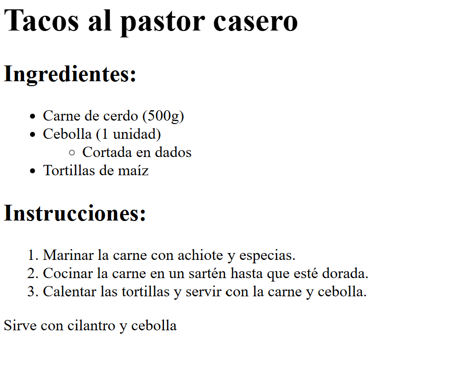
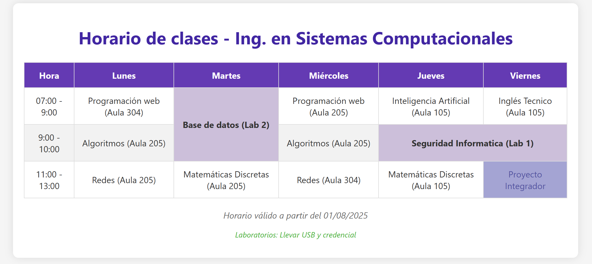
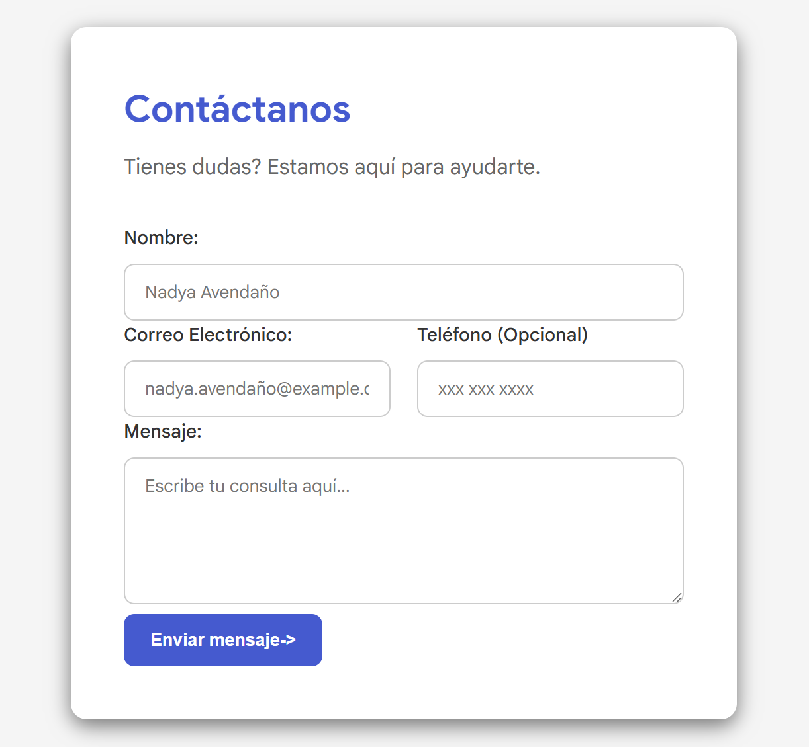
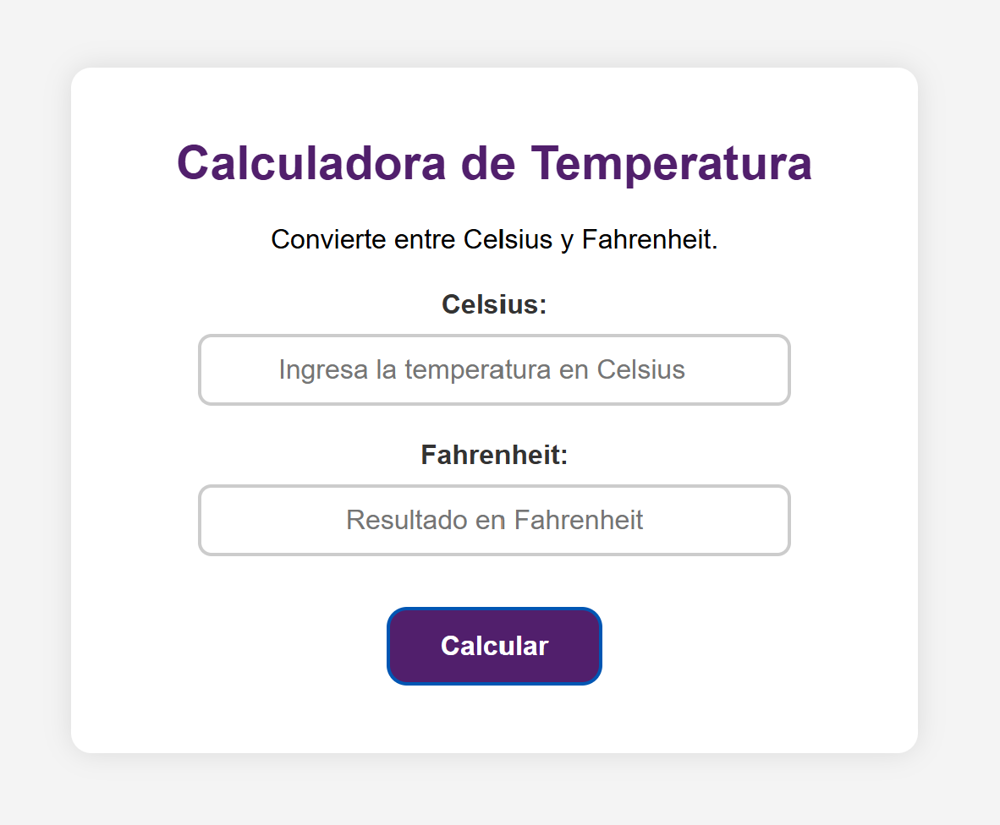
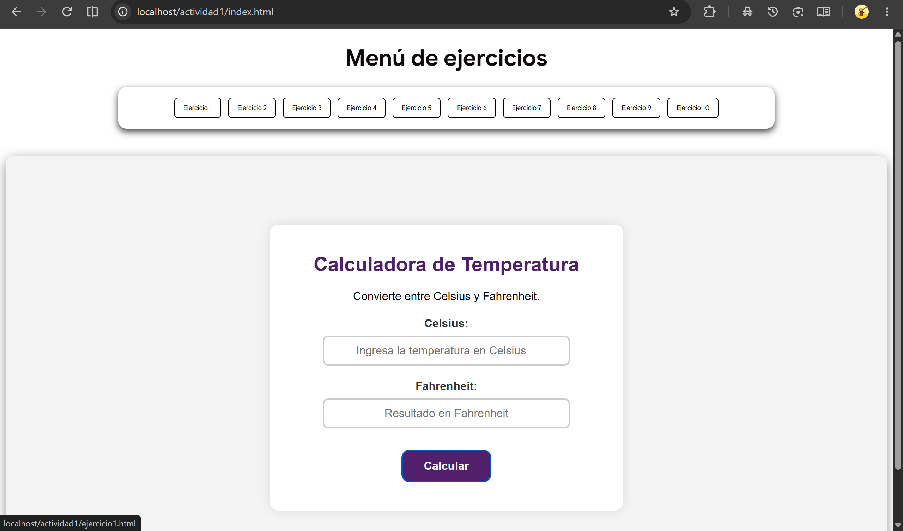

Este repositorio contiene la integración de los 18 ejercicios prácticos trabajados en clase correspondiente al Tema 2.

El proyecto consta de una interfaz principal (index.html) que funciona como un menú centralizado. A través de un contenedor iframe, el usuario puede navegar y ejecutar cada uno de los ejercicios de forma interactiva sin salir de la página principal.

index.html: Página principal con el menú de navegación e iframe.
css/: Hojas de estilo para la interfaz del menú y los ejercicios.
js/: Lógica de interacción y funciones JavaScript de los ejercicios.
img/: Archivos multimedia e imágenes utilizadas.
ejercicio1.html a ejercicio18.html: Archivos independientes con cada práctica.

Usuario GitHub: @yailivach91-ctrl